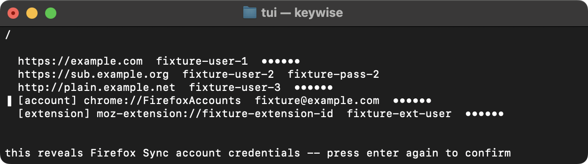
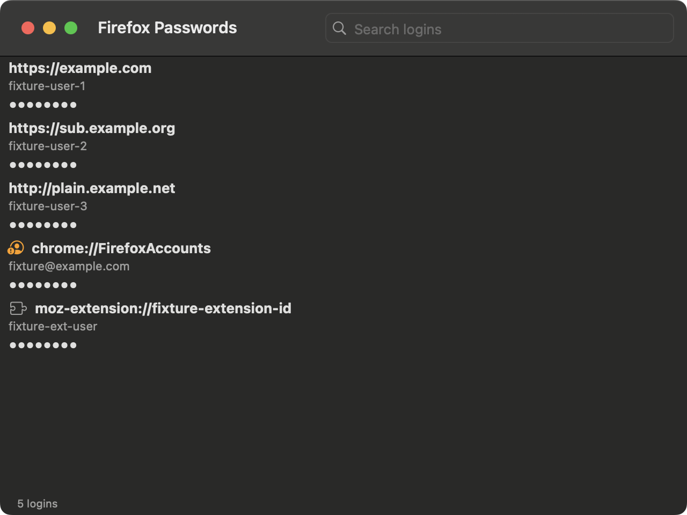

#  Firefox Password View

[](https://github.com/lkraider/firefox-password-view/actions/workflows/ci.yml)

A terminal UI, a macOS app and a Windows app show the saved logins in a
local Firefox profile. All three link one Zig core. The released binaries are
Apple Silicon macOS, Windows x86_64 and Windows ARM64.

### TUI



### SwiftUI



### Win32

The Windows app shows the same list in a `SysListView32`. A `Profile` menu
switches profiles, right-click offers Reveal and Copy, and the status bar
shows the message and the row count.

## Installing

```
brew tap lkraider/firefox-password-view https://github.com/lkraider/firefox-password-view
brew trust lkraider/firefox-password-view  # Homebrew 6.0 and newer
brew install ffpw                          # the terminal UI
brew install --cask firefox-password-view  # the macOS app
```

The app is ad-hoc signed. This project has no Apple Developer ID, so it is
not notarized. On first launch, right-click the app in Finder and choose
Open. Gatekeeper otherwise blocks it as coming from an unidentified
developer.

On Windows, download `FirefoxPasswordView-<version>-windows-arm64.zip` or
`-windows-x86_64.zip` from the releases page and unzip it. The exe is a
single file and needs no install. It is unsigned, so SmartScreen shows a
warning on first launch. Choose More info, then Run anyway.

## Using it

Run `ffpw`. It reads `profiles.ini` under `~/Library/Application
Support/Firefox` and opens the profile your Firefox uses. It prompts for a
Primary Password when the profile has one.

| Key | Does |
|---|---|
| `/` | Enter the search field. `enter` or `escape` leaves it. |
| `↑` `↓`, `k` `j` | Move through the list. |
| `enter` | Reveal the selected password. Press again to hide it. |
| `y` | Copy the selected password. The row stays masked. |
| `q`, `ctrl-c` | Quit. |

To open another profile:

```
ffpw --list-profiles       # one profile per line, name then path
ffpw --profile <path>      # open that directory
```

On Windows, run `FirefoxPasswordView.exe`. It reads `profiles.ini` under
`%APPDATA%\Mozilla\Firefox`. The `Profile` menu lists every profile it
found, and `--profile <path>` opens one directory.

| Key | Does |
|---|---|
| `Ctrl+F` | Move focus to the search box. |
| `Enter`, double-click | Reveal the selected password. Press again to hide it. |
| `Ctrl+C` | Copy the selected password. The row stays masked. |
| `Esc` | Hide the revealed password. |
| right-click | Reveal and Copy for the row under the cursor. |

Passwords stay masked until you press `enter`, and only the selected one is
shown. The macOS app shows the same data under the same rules. Each row
there carries a copy button that leaves the row masked, and a revealed
password masks itself again after 30 seconds.

## Limits

This reads a profile and writes nothing back. `core/src/sqlitedb.zig` opens
`key4.db` read-only and reads the SQLite file format directly, so it is safe
to run while Firefox has the profile open.

It cannot read these profiles:

- One with a Primary Password you do not know. Decryption uses the
  password you type. There is no recovery path.
- One that Firefox 144 or newer has never opened. Those hold
  3DES-encrypted entries only. This tool reports 3DES per entry and stops
  there.
- One whose `key4.db` uses a WAL journal. NSS writes a rollback journal, and
  every profile measured reports write version 1. The reader reports
  `WalJournal` if that ever changes.

## Security

Copying marks the clipboard entry `org.nspasteboard.ConcealedType` on macOS.
On Windows it sets `ExcludeClipboardContentFromMonitorProcessing`,
`CanIncludeInClipboardHistory`, `CanUploadToCloudClipboard` and
`Clipboard Viewer Ignore`. Those four formats keep the password out of
`Win+V` history and out of the cloud clipboard. Both platforms clear the clipboard 30 seconds
later, and a copy someone else made in between survives. Copying never puts
the password on screen. In the macOS app and in the Windows app a revealed
password masks itself after the same 30 seconds. There are no network calls
and no telemetry.

Anyone who can read your files or your memory already has this data.
`key4.db` is readable by your own user, and Firefox exposes the same
logins. Once a password reaches a buffer, copies of it exist. This code
wipes the buffers it owns.

A profile synced to a Mozilla Account holds a `chrome://FirefoxAccounts`
row. Its password is sync key material, so revealing it hands over the
whole account. Both front ends mark that row and ask a second time before
revealing it.

## Building

Needs [Zig 0.16.0](https://ziglang.org/download/#release-0.16.0). On macOS it
also needs Xcode Command Line Tools (`xcode-select --install`), because the C
ABI library links libc and `core/test/oracle.zig` links `libsqlite3` through
the SDK those tools install.

```
zig build          # core, the TUI, and the C ABI static library
zig build test     # the core tests, against the committed fixtures
zig build tui      # run the TUI
zig build smoke    # the C ABI smoke test
```

`zig build test` reads only `core/testdata/`. It runs on a machine with no
Firefox installed. Pass `-Doracle=false` to drop the test that diffs the
SQLite reader against the system sqlite3.

The Windows app cross-compiles from macOS or Linux with no Windows SDK:

```
zig build win -Dtarget=aarch64-windows-gnu -Doptimize=ReleaseSafe
zig build win -Dtarget=x86_64-windows-gnu  -Doptimize=ReleaseSafe
```

`ReleaseSafe` is the mode the released zips ship. It keeps the bounds and
alignment checks that guard the hand-written `key4.db` reader.

`python3 scripts/make-ico.py` regenerates `win/icon.ico` from the committed
macOS artwork. The `.ico` is committed, so a build needs neither that script
nor macOS.

The macOS app is a separate Swift package. See
[`macos/README.md`](macos/README.md) for how to build and test it.

`scripts/screenshots.sh` regenerates the two images above.

## Layout

```
core/       key4.db and logins.json decryption, and the C ABI
tui/        the terminal UI, on libvaxis
macos/      the SwiftUI app
win/        the Win32 app
tools/      the fixture generator
```

[`docs/DESIGN.md`](docs/DESIGN.md) has the on-disk format, the reasoning
behind each decision in the core, and what a front end on another platform
has to link.

## License

MIT. See [`LICENSE`](LICENSE).
